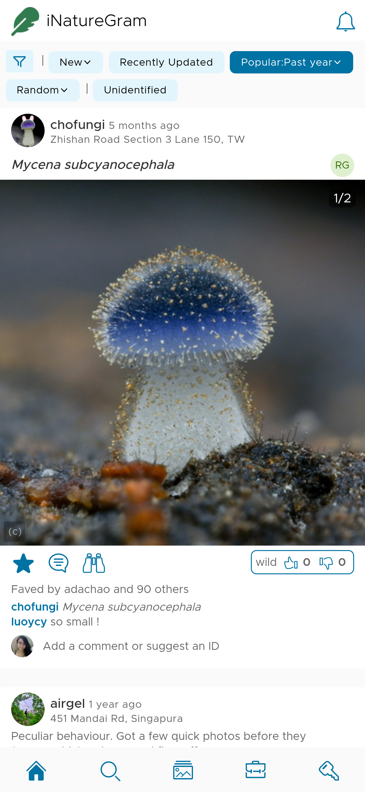
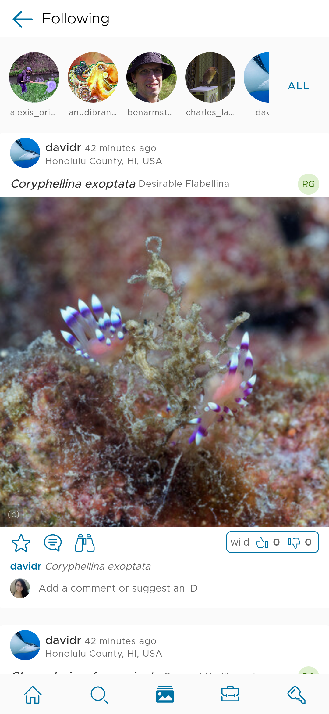
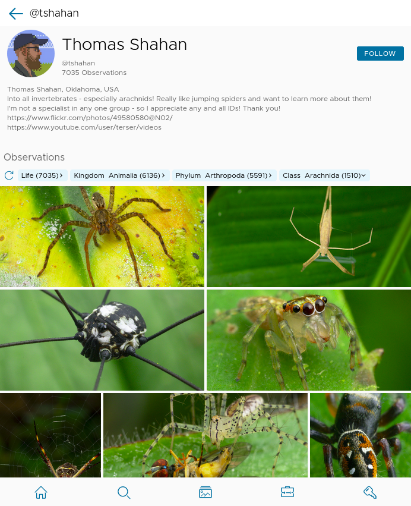
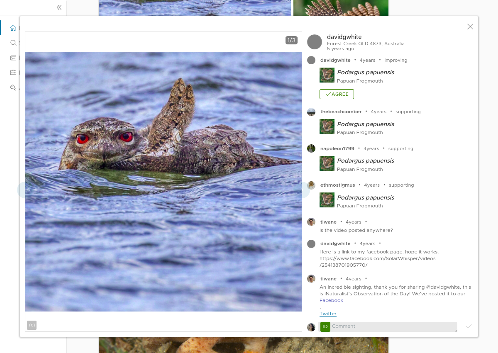

# NatureGram
Endless scroll of inaturalist observations






## Built With
* Angular
* Clarity
* iNaturalist API

# Prereq
podman

## Setup 

```bash
#Build container image (This repo includes a Containerfile) 
podman build -t angular:alpine .

#Install dependencies
./run npm install

#Build and serve
./run ng serve 
```

